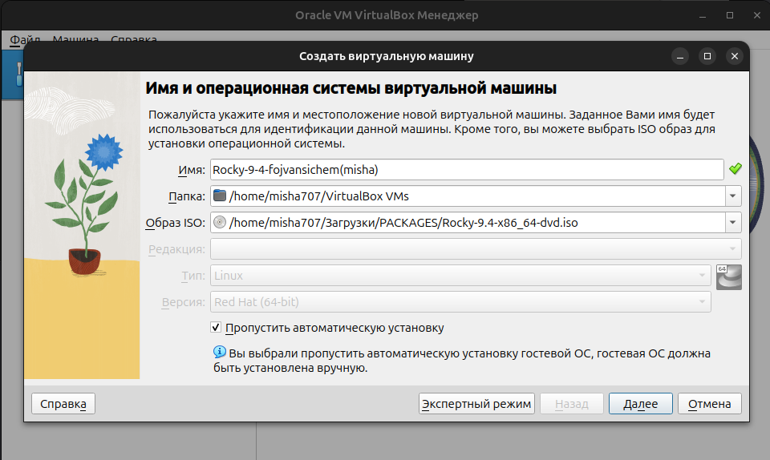
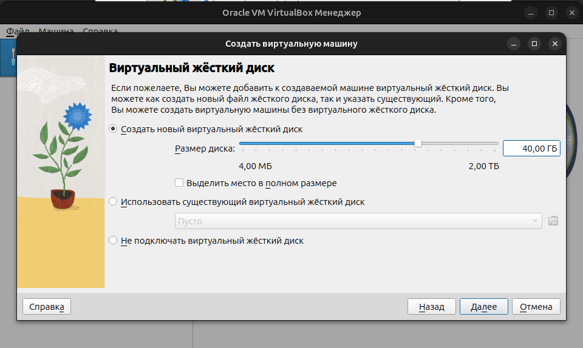
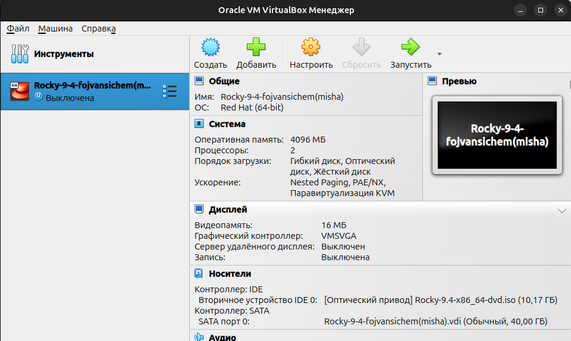
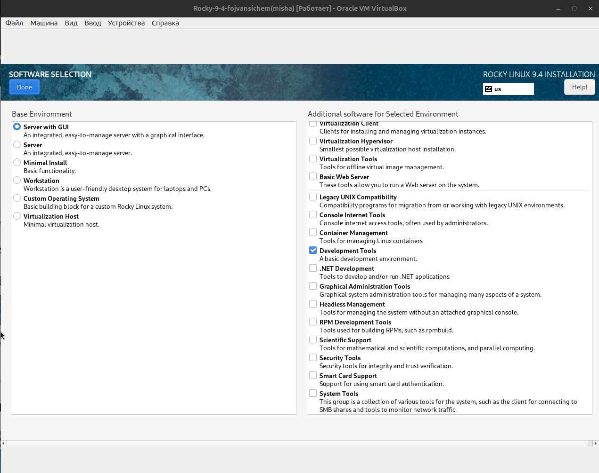
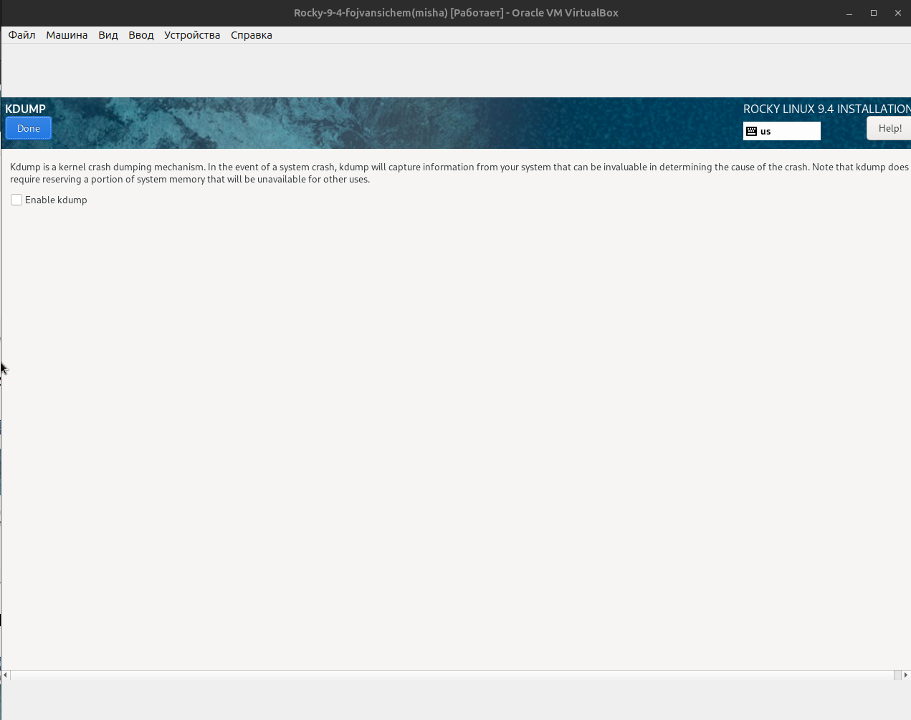
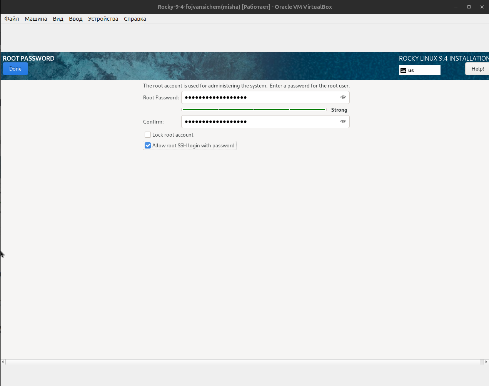
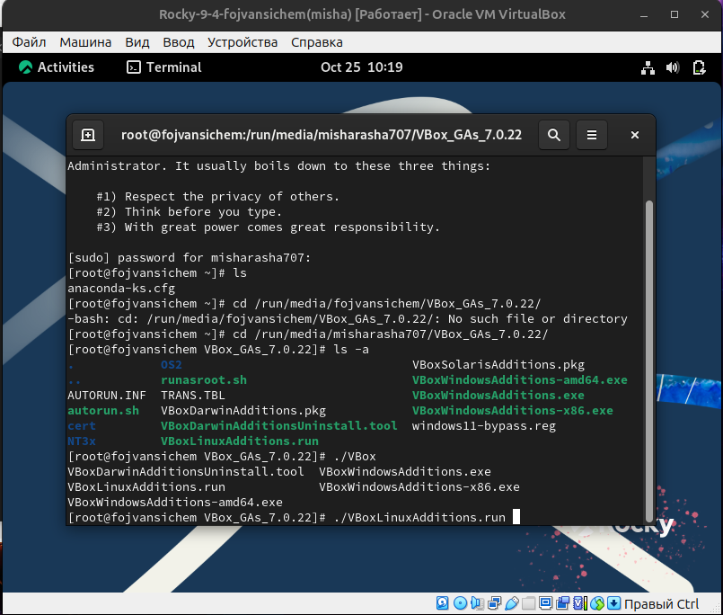
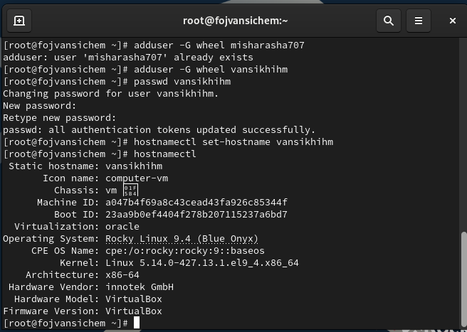

---
## Front matter
title: "Отчёт по лабораторной работе №1"
subtitle: "Установка и конфигурация
операционной системы на виртуальную машину"
author: "Ван Сихэм Франклин О Нил Джон (Миша)"

## Generic otions
lang: ru-RU
toc-title: "Содержание"

## Bibliography
bibliography: bib/cite.bib
csl: pandoc/csl/gost-r-7-0-5-2008-numeric.csl

## Pdf output format
toc: true # Table of contents
toc-depth: 2
lof: true # List of figures
lot: true # List of tables
fontsize: 12pt
linestretch: 1.5
papersize: a4
documentclass: scrreprt

## I18n polyglossia
polyglossia-lang:
  name: russian
  options:
	- spelling=modern
	- babelshorthands=true
polyglossia-otherlangs:
  name: english

## I18n babel
babel-lang: russian
babel-otherlangs: english

## Fonts
mainfont: IBM Plex Serif
romanfont: IBM Plex Serif
sansfont: IBM Plex Sans
monofont: IBM Plex Mono
mathfont: STIX Two Math
mainfontoptions: Ligatures=Common,Ligatures=TeX,Scale=0.94
romanfontoptions: Ligatures=Common,Ligatures=TeX,Scale=0.94
sansfontoptions: Ligatures=Common,Ligatures=TeX,Scale=MatchLowercase,Scale=0.94
monofontoptions: Scale=MatchLowercase,Scale=0.94,FakeStretch=0.9
mathfontoptions:

## Biblatex
biblatex: true
biblio-style: "gost-numeric"
biblatexoptions:
  - parentracker=true
  - backend=biber
  - hyperref=auto
  - language=auto
  - autolang=other*
  - citestyle=gost-numeric

## Pandoc-crossref LaTeX customization
figureTitle: "Рис."
tableTitle: "Таблица"
listingTitle: "Листинг"
lofTitle: "Список иллюстраций"
lotTitle: "Список таблиц"
lolTitle: "Листинги"

## Misc options
indent: true
header-includes:
  - \usepackage{indentfirst}
  - \usepackage{float} # keep figures where there are in the text
  - \floatplacement{figure}{H} # keep figures where there are in the text
---

# Цель работы

Целью данной работы является приобретение практических навыков установки операционной системы на виртуальную машину, настройки минимально необходимых для
дальнейшей работы сервисов.


# Выполнение лабораторной работы

{ width=70%}


{#fig:002 width=70%}


{#fig:003 width=70%}

{#fig:004 width=70%}

{#fig:005 width=70%}

{#fig:006 width=70%}

{#fig:007 width=70%}

{#fig:008 width=70%}

{#fig:009 width=70%}

{#fig:010 width=70%}

{#fig:011 width=70%}

{#fig:012 width=70%}

{#fig:013 width=70%}

{#fig:014 width=70%}

{#fig:015 width=70%}

После загрузки дополнений нажмите Return или Enter и корректно перезагрузите вир-
туальную машину.
Если по каким-то причинам образ диска дополнений гостевой ОС не уста-
навливается через графическое меню, можно воспользоваться консольными
командами (рис. 1.16). Войдите в ОС под заданной вами при установке учёт-
ной записью пользователя, получите полномочия администратора, перейдите
в каталог /run/media/имя_пользователя/VBox_GAs_версия/, затем запустите
VBoxLinuxAdditions.run:
	
	sudo -i
	
	cd /run/media/имя_пользователя/VBox_GAs_версия/.VBoxLinuxAdditions.run

{#fig:016 width=70%}

## Установка имени пользователя и названия хоста

Если при установке виртуальной машины вы задали имя пользователя или имя хоста, не удовлетворяющее соглашению об именовании (см. раздел 1.2.2), то вам необходимо исправить это.

1. Запустите виртуальную машину и залогиньтесь.

2. Запустите терминал и получите полномочия администратора:
	
	```
	sudo -i
	```

3. Создайте пользователя (вместо username укажите ваш логин в дисплейном классе):

	```
	adduser -G wheel username
	```

4. Задайте пароль для пользователя (вместо username укажите ваш логин в дисплейном классе):
	
	```
	passwd username
    ```

5. Установите имя хоста (вместо username укажите ваш логин в дисплейном классе):
	
	```
	hostnamectl set-hostname username
	```

6. Проверьте, что имя хоста установлено верно:
	
	```
	hostnamectl
	```

{#fig:017 width=70%}


## Домашнее задание

Дождитесь загрузки графического окружения и откройте терминал. В окне терминала проанализируйте последовательность загрузки системы, выполнив команду `dmesg`.
Можно просто просмотреть вывод этой команды:

```
	dmesg | less
```

{#fig:018 width=70%}

Получите следующую информацию.

1. Версия ядра Linux (Linux version).

{#fig:019 width=70%}

2. Частота процессора (Detected Mhz processor).

{#fig:020 width=70%}

3. Модель процессора (CPU0).

{#fig:021 width=70%}

4. Объем доступной оперативной памяти (Memory available).

{#fig:022 width=70%}

5. Тип обнаруженного гипервизора (Hypervisor detected).

{#fig:023 width=70%}

6. Тип файловой системы корневого раздела.

{#fig:024 width=70%}

7. Последовательность монтирования файловых систем.

{#fig:025 width=70%}


# Контрольные вопросы
1. Укажите команды терминала и приведите примеры:

– для получения справки по команде;
```
	man ls
```
{#fig:026 width=70%}

– для перемещения по файловой системе;
```
	cd <каталог>
```
{#fig:027 width=70%}

– для просмотра содержимого каталога;
```
	ls
```
{#fig:028 width=70%}

– для определения объёма каталога;
```
	du -sh <каталог>
```
{#fig:029 width=70%}

– для создания / удаления каталогов / файлов;
```
	mkdir <каталог> (Создает новый каталог)
	rmdir <каталог> (Удаляет пустой каталог)
	rm <файл> (Удаляет файл)
```
{#fig:030 width=70%}

– для задания определённых прав на файл / каталог;
```
	chmod <права> <файл>
```
{#fig:031 width=70%}

– для просмотра истории команд.
```
	history
```
{#fig:032 width=70%}


2. Какую информацию содержит учётная запись пользователя? Какие команды позволяют посмотреть информацию о пользователе?

`Учетная запись пользователя содержит информацию о владельце, домашнем каталоге, пароле, группах, к которым принадлежит пользователь, и других настройках.`


3. Что такое файловая система? Приведите примеры с краткой характеристикой.

`Файловая система - это способ организации данных на носителе информации (диск, флешка и т.д.). Она определяет, как данные хранятся, как к ним обращаться и как они структурированы.`

```
    Примеры:
        EXT4: Одна из самых распространенных 
        файловых систем для Linux, поддерживает большие разделы и множество функций.
        XFS: Высокопроизводительная файловая система, часто используется 
        на серверах.
        NTFS: Основная файловая система для Windows.
        FAT32: Простая файловая система, часто используется на флешках.
```

4. Как посмотреть, какие файловые системы подмонтированы в ОС?

` mount: Отображает список смонтированных файловых систем.`

5. Как удалить зависший процесс?

```
	Определение PID процесса:

    ps aux | grep <часть имени процесса>: Находит процесс по части его имени.

	Удаление процесса:

    kill -9 <PID>: Принудительно завершает процесс с указанным идентификатором. 
    Будьте осторожны, это может привести к нестабильности системы.
```


# Выводы

В результате выполнения лабораторной работы была успешно создана и настроена виртуальная машина с операционной системой Ubuntu 22.04 LTS. Получены практические навыки работы с программой VirtualBox и базовой конфигурации операционной системы Linux.

# Список литературы{.unnumbered}

1. Купер М. Искусство программирования на языке сценариев командной оболочки. — 2004. — URL: https://www.opennet.ru/docs/RUS/bash_scripting_guide/.

2. Newham C. Learning the bash Shell: Unix Shell Programming. — O’Reilly Media, 2005. —(In a Nutshell).

3. Робачевский А., Немнюгин С., Стесик О. Операционная система UNIX. — 2-е изд. — БХВ-Петербург, 2010.

4. Колисниченко Д. Н. Самоучитель системного администратора Linux. — СПб. : БХВ-Петербург, 2011. — (Системный администратор).

5. Dash P. Getting Started with Oracle VM VirtualBox. — Packt Publishing Ltd, 2013.

6. Colvin H. VirtualBox: An Ultimate Guide Book on Virtualization with VirtualBox. — CreateSpace Independent Publishing Platform, 2015.

7. Таненбаум Э., Бос Х. Современные операционные системы. — 4-е изд. — СПб. : Питер, 2015. — (Классика Computer Science).

8. GNU Bash Manual. — 2016. — URL: https:// www.gnu.org/software/bash/manual/.

9. Robbins A. Bash Pocket Reference. - O’Reilly Media, 2016.

10. Vugt S. van. Red Hat RHCSA/RHCE 7 cert guide : Red Hat Enterprise Linux 7 (EX200 andEX300). — Pearson IT Certification, 2016. — (Certification Guide).

11. Zarrelli G. Mastering Bash. — Packt Publishing, 2017.

12. Unix и Linux: руководство системного администратора / Э. Немет, Г. Снайдер, Т.
Хейн, Б. Уэйли, Д. Макни. — 5-е изд. — СПб. : ООО «Диалектика», 2020.

::: {#refs}
:::
