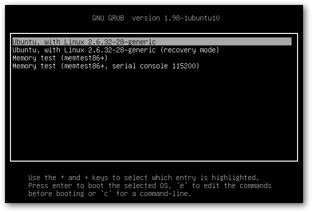
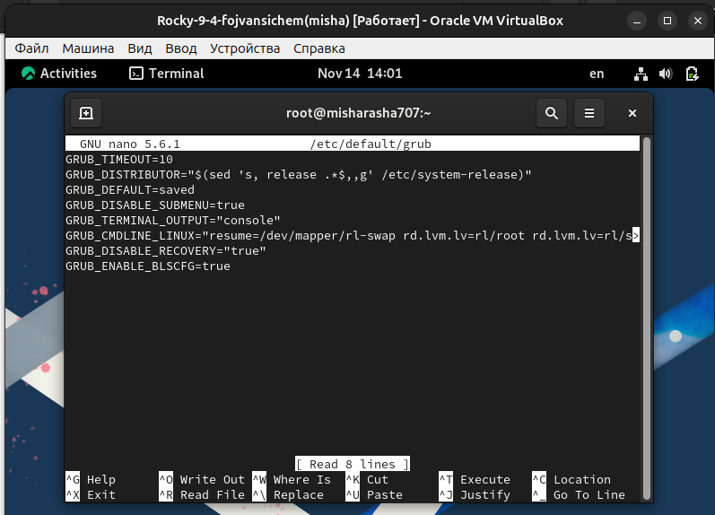
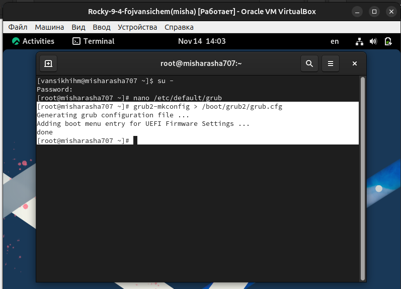
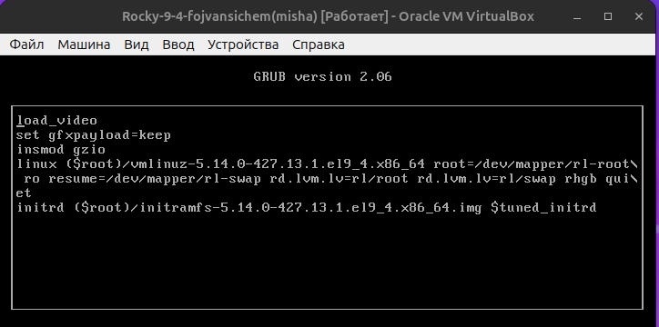
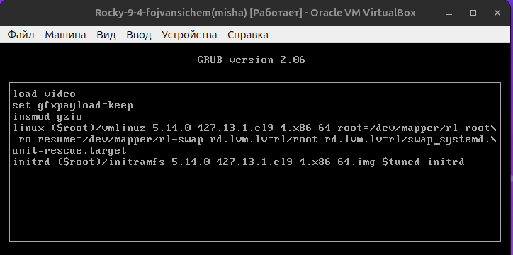
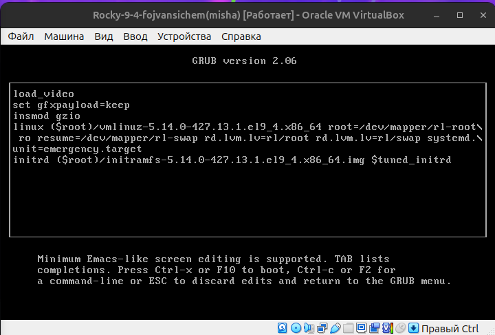
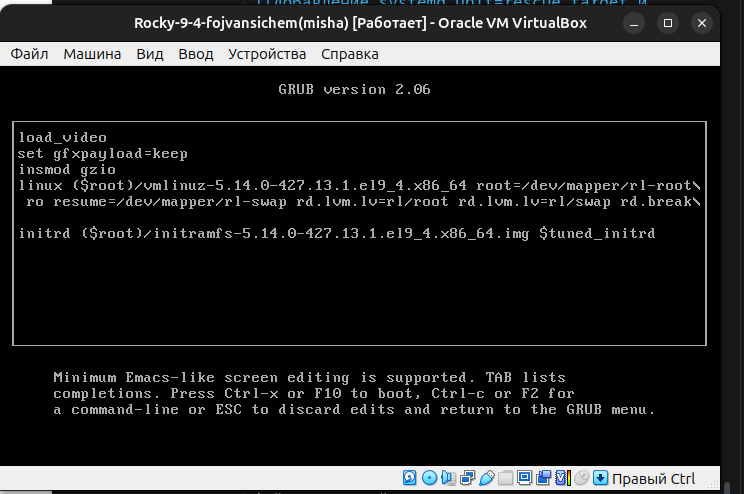
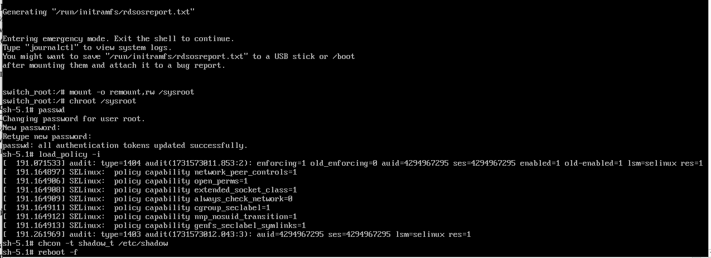

---
## Front matter
title: "Защита отчёта по лабораторной работе №11"
subtitle: "Управление Загрузкой Системы (GRUB2)"
author: "Ван Сихэм Франклин О Нил Джон (Миша)"

## Generic otions
lang: ru-RU
toc-title: "Содержание"

## Bibliography
bibliography: bib/cite.bib
csl: pandoc/csl/gost-r-7-0-5-2008-numeric.csl

## Pdf output format
toc: true # Table of contents
toc-depth: 2
lof: true # List of figures
lot: true # List of tables
fontsize: 12pt
linestretch: 1.5
papersize: a4
documentclass: scrreprt
## I18n polyglossia
polyglossia-lang:
  name: russian
  options:
	- spelling=modern
	- babelshorthands=true
polyglossia-otherlangs:
  name: english
## I18n babel
babel-lang: russian
babel-otherlangs: english
## Fonts
mainfont: IBM Plex Serif
romanfont: IBM Plex Serif
sansfont: IBM Plex Sans
monofont: IBM Plex Mono
mathfont: STIX Two Math
mainfontoptions: Ligatures=Common,Ligatures=TeX,Scale=0.94
romanfontoptions: Ligatures=Common,Ligatures=TeX,Scale=0.94
sansfontoptions: Ligatures=Common,Ligatures=TeX,Scale=MatchLowercase,Scale=0.94
monofontoptions: Scale=MatchLowercase,Scale=0.94,FakeStretch=0.9
mathfontoptions:
## Biblatex
biblatex: true
biblio-style: "gost-numeric"
biblatexoptions:
  - parentracker=true
  - backend=biber
  - hyperref=auto
  - language=auto
  - autolang=other*
  - citestyle=gost-numeric
## Pandoc-crossref LaTeX customization
figureTitle: "Рис."
tableTitle: "Таблица"
listingTitle: "Листинг"
lofTitle: "Список иллюстраций"
lotTitle: "Список таблиц"
lolTitle: "Листинги"
## Misc options
indent: true
header-includes:
  - \usepackage{indentfirst}
  - \usepackage{float} # keep figures where there are in the text
  - \floatplacement{figure}{H} # keep figures where there are in the text
---

# Введение

Что такое GRUB2?

> GRUB2 - это загрузчик системы. Он отвечает за загрузку операционной системы. Ключевой файл: `/boot/grub2/grub.cfg`. Этот файл генерируется автоматически с помощью файла настроек `/etc/default/grub` и скриптов из директории `/etc/grub.d`.

{#fig:000 width=70%}

# Цели Лабораторной Работы №11

* Модификация параметров GRUB2.
* Устранение неполадок в GRUB2.
* Работа с GRUB2 без прав root.

# Модификация Параметров GRUB2
## Изменение Таймаута GRUB2

* Редактирование /etc/default/grub.
* Установка GRUB_TIMEOUT=10.
* Обновление /boot/grub2/grub.cfg с помощью grub2-mkconfig.

{#fig:001 width=70%}

{#fig:002 width=70%}

# Устранение Неполадок GRUB2
## Решение Проблем с GRUB2

* Редактирование строки ядра в grub.cfg (начинающейся с linux ($root)).
* Добавление/удаление параметров, таких как rhgb и quiet.
* Использование rescue.target и emergency.target.

{#fig:003 width=70%}

{#fig:004 width=70%}

{#fig:005 width=70%}

# Сброс Пароля Root

* Редактирование grub.cfg (начинающейся с linux ($root)) для добавления rd.break.
* Монтирование корневой файловой системы.
* Переход в chroot в систему.
* Изменение пароля root.

{#fig:006 width=70%}

{#fig:007 width=70%}

# Заключение

В ходе выполнения лабораторной работы №11 были успешно освоены основ-
ные принципы работы с загрузчиком GRUB2. Полученные знания позволят эф-
фективно управлять процессом загрузки системы и устранять возникающие
проблемы.

# Список литературы{.unnumbered}

1. Колисниченко Д. Н. Самоучитель системного администратора Linux. — СПб. : БХВ-Петербург, 2011. — (Системный администратор).

2. Neil N. J. Learning CentOS: A Beginners Guide to Learning Linux. — CreateSpace Independent Publishing Platform, 2016.

3. Unix и Linux: руководство системного администратора / Э. Немет, Г. Снайдер, Т.
Хейн, Б. Уэйли, Д. Макни. — 5-е изд. — СПб. : ООО «Диалектика», 2020.

::: {#refs}
:::
