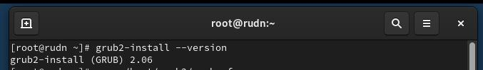
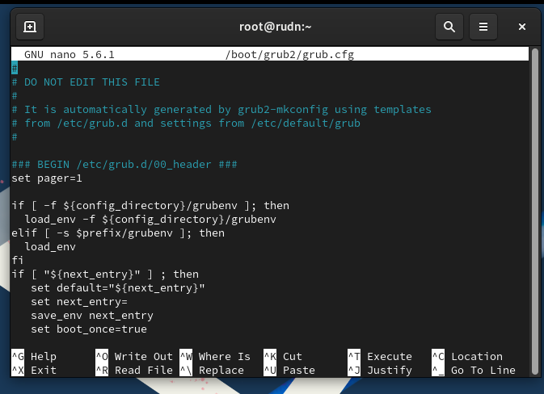
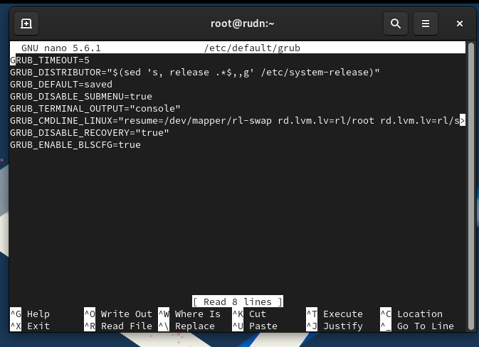
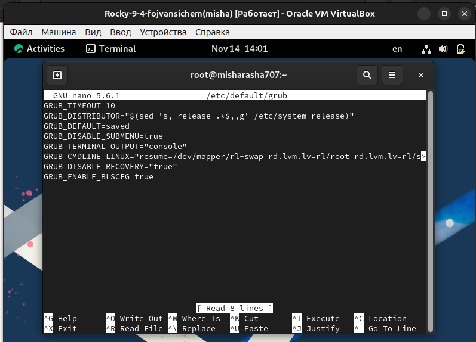
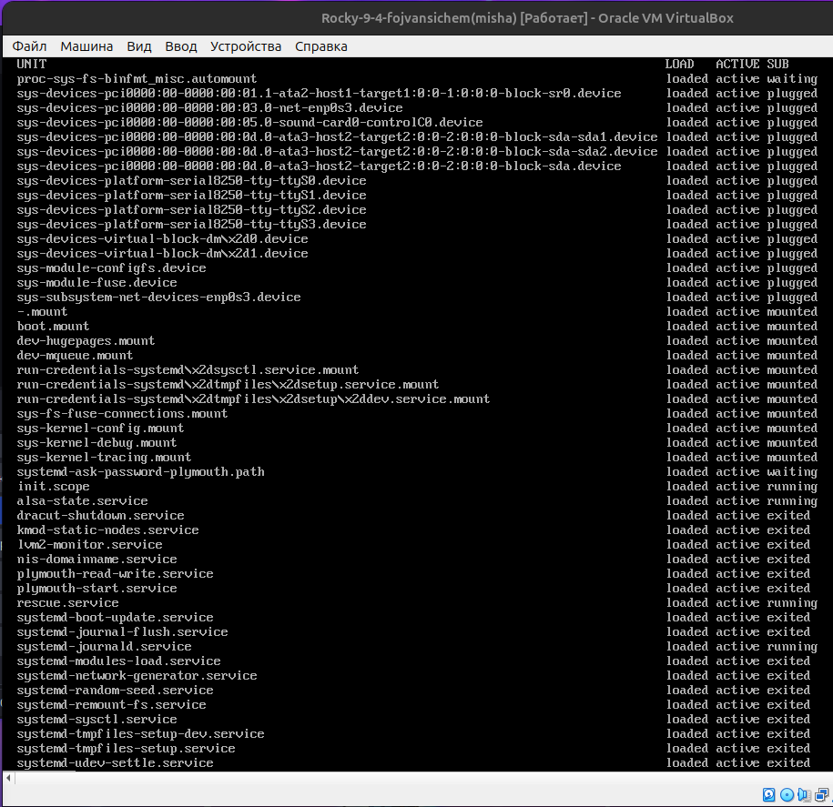
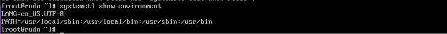
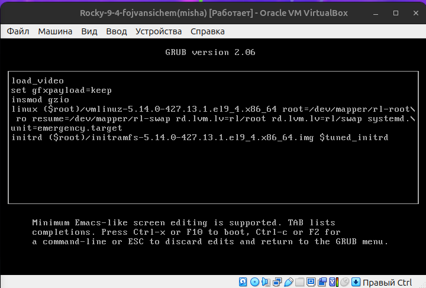
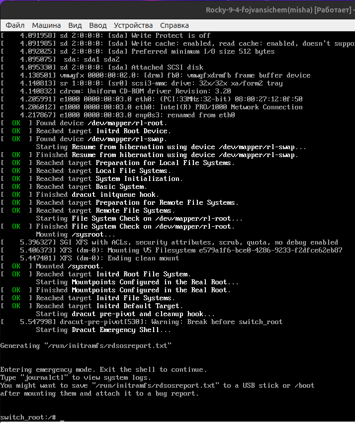

---
## Front matter
title: "Отчёт по лабораторной работе №11"
subtitle: "Управление загрузкой системы (GRUB2)"
author: "Ван Сихэм Франклин О Нил Джон (Миша)"

## Generic otions
lang: ru-RU
toc-title: "Содержание"

## Bibliography
bibliography: bib/cite.bib
csl: pandoc/csl/gost-r-7-0-5-2008-numeric.csl

## Pdf output format
toc: true # Table of contents
toc-depth: 2
lof: true # List of figures
lot: true # List of tables
fontsize: 12pt
linestretch: 1.5
papersize: a4
documentclass: scrreprt

## I18n polyglossia
polyglossia-lang:
  name: russian
  options:
	- spelling=modern
	- babelshorthands=true
polyglossia-otherlangs:
  name: english

## I18n babel
babel-lang: russian
babel-otherlangs: english

## Fonts
mainfont: IBM Plex Serif
romanfont: IBM Plex Serif
sansfont: IBM Plex Sans
monofont: IBM Plex Mono
mathfont: STIX Two Math
mainfontoptions: Ligatures=Common,Ligatures=TeX,Scale=0.94
romanfontoptions: Ligatures=Common,Ligatures=TeX,Scale=0.94
sansfontoptions: Ligatures=Common,Ligatures=TeX,Scale=MatchLowercase,Scale=0.94
monofontoptions: Scale=MatchLowercase,Scale=0.94,FakeStretch=0.9
mathfontoptions:

## Biblatex
biblatex: true
biblio-style: "gost-numeric"
biblatexoptions:
  - parentracker=true
  - backend=biber
  - hyperref=auto
  - language=auto
  - autolang=other*
  - citestyle=gost-numeric

## Pandoc-crossref LaTeX customization
figureTitle: "Рис."
tableTitle: "Таблица"
listingTitle: "Листинг"
lofTitle: "Список иллюстраций"
lotTitle: "Список таблиц"
lolTitle: "Листинги"

## Misc options
indent: true
header-includes:
  - \usepackage{indentfirst}
  - \usepackage{float} # keep figures where there are in the text
  - \floatplacement{figure}{H} # keep figures where there are in the text
---

# Цель работы

Получить навыки работы с загрузчиком системы GRUB2.

# Задание

1. Продемонстрируйте навыки по изменению параметров GRUB и записи изменений в файл конфигурации.
2. Продемонстрируйте навыки устранения неполадок при работе с GRUB.
3. Продемонстрируйте навыки работы с GRUB без использования root.

# Общие сведения о GRUB

Загрузка операционной системы непосредственно после включения и запуска начальной загрузочной последовательности действий компьютера осуществляется специальным программным обеспечением — загрузчиком операционной системы.
Наиболее распространённый загрузчик для Unix/Linux операционных систем — GRUB
(GRand Unified Bootloader). Определить версию загрузчика можно с помощью команды

```nasm
	grub2-install --version
```

{#fig:001 width=70%}

Основной файл конфигурации GRUB2 — /boot/grub2/grub.cfg.
 
{#fig:002 width=70%}

Этот файл генерируется автоматически с помощью файла настроек /etc/default/grub и скриптов из директории /etc/grub.d.

{#fig:003 width=70%}

# Выполнение лабораторной работы
## Модификация параметров GRUB2

> В файле /etc/default/grub установите параметр отображения меню загрузки в течение 10 секунд:

```nasm
	GRUB_TIMEOUT=10
```

{#fig:004 width=70%}

Записываем изменения в GRUB2, введя в командной строке

```nasm
	grub2-mkconfig > /boot/grub2/grub.cfg
```

или

```nasm
	grub2-mkconfig -o /boot/grub2/grub.cfg
```

{#fig:005 width=70%}

> Перезагрузите систему и убедитесь, что при загрузке вы видите прокрутку загрузочных сообщений. Если вы не наблюдаете меню GRUB, то в файле /etc/default/grub удалите из строки указания параметров запуска ядра системы GRUB_CMDLINE_LINUX параметры rhgb и quiet, которые отвечают за показ графической заставки при запуске системы (для дистрибутивов, основанных на Red Hat), скрывая процесс загрузки от пользователя. Сохраните изменения в файле и закройте редактор. Запишите изменения в GRUB2.

## Устранения неполадок

{#fig:006 width=70%}

{#fig:007 width=70%}


{#fig:008 width=70%}

{#fig:009 width=70%}

{#fig:010 width=70%}

>После успешного входа в систему посмотрите список всех загруженных файлов модулей:

{#fig:011 width=70%}

Обратите внимание, что количество загружаемых файлов модулей уменьшилось до
минимума.

{#fig:012 width=70%}


## Сброс пароля root

{#fig:013 width=70%}

{#fig:014 width=70%}


1. Для получения доступа к системному образу для чтения и записи: `mount -o remount,rw /sysroot`

2. Сделать содержимое каталога /sysimage новым корневым каталогом: `chroot /sysroot`

3. Ввести команду задания пароля: `passwd` и установить новый пароль для пользователя root.

4. Поскольку на этом очень раннем этапе загрузки SELinux ещё не активирован, то тип контекста SELinux для файла /etc/shadow будет испорчен. Если вы перезагрузитесь в этот момент, то никто не сможет войти в систему. Поэтому вы должны убедиться, что тип контекста установлен правильно. Чтобы сделать это, на этом этапе вы должны загрузить политику SELinux с помощью команды: `load_policy -i`

5. Теперь вы можете вручную установить правильный тип контекста для /etc/shadow.
Для этого введите: `chcon -t shadow_t /etc/shadow`

6. Перезагрузите систему с помощью команды `reboot -f` и войдите в систему с изменённым паролем для пользователя root.

{#fig:015 width=70%}

# Контрольные вопросы

* Какой файл конфигурации следует изменить для применения общих изменений
в GRUB2?

Для внесения общих изменений в GRUB2, таких как установка таймаута, выбор по умолчанию и других глобальных параметров, обычно редактируют файл `/etc/default/grub`


* Как называется конфигурационный файл GRUB2, в котором вы применяете изменения
для GRUB2?

`/boot/grub/grub.cfg`. Этот файл генерируется автоматически на основе настроек из /etc/default/grub и других конфигурационных файлов. В него записываются все детали о доступных для загрузки операционных системах, их ядрах и параметрах загрузки.

* После внесения изменений в конфигурацию GRUB2, какую команду вы должны выполнить, чтобы изменения сохранились и воспринялись при загрузке системы?

После внесения изменений в файл `/etc/default/grub` необходимо обновить файл `/boot/grub/grub.cfg`, чтобы изменения вступили в силу. Для этого обычно выполняется следующая команда:
`grub2-mkconfig > /boot/grub2/grub.cfg`


# Выводы

В ходе выполнения лабораторной работы №11 были успешно освоены основные принципы работы с загрузчиком GRUB2. Полученные знания позволят эффективно управлять процессом загрузки системы и устранять возникающие проблемы

# Список литературы{.unnumbered}

1. Колисниченко Д. Н. Самоучитель системного администратора Linux. — СПб. : БХВ-Петербург, 2011. — (Системный администратор).

2. Neil N. J. Learning CentOS: A Beginners Guide to Learning Linux. — CreateSpace Independent Publishing Platform, 2016.

3. Unix и Linux: руководство системного администратора / Э. Немет, Г. Снайдер, Т. Хейн, Б. Уэйли, Д. Макни. — 5-е изд. — СПб. : ООО «Диалектика», 2020.

::: {#refs}
:::
