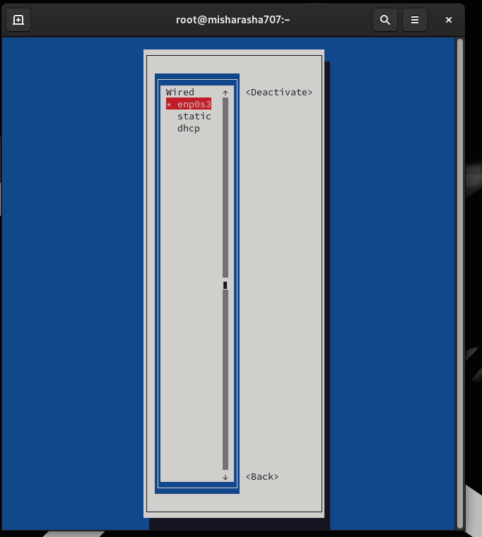

---
## Front matter
title: "Отчёт по лабораторной работе №12"
subtitle: "Настройки сети в Linux"
author: "Ван Сихэм Франклин О Нил Джон (Миша)"

## Generic otions
lang: ru-RU
toc-title: "Содержание"

## Bibliography
bibliography: bib/cite.bib
csl: pandoc/csl/gost-r-7-0-5-2008-numeric.csl

## Pdf output format
toc: true # Table of contents
toc-depth: 2
lof: true # List of figures
lot: true # List of tables
fontsize: 12pt
linestretch: 1.5
papersize: a4
documentclass: scrreprt
## I18n polyglossia
polyglossia-lang:
  name: russian
  options:
	- spelling=modern
	- babelshorthands=true
polyglossia-otherlangs:
  name: english
## I18n babel
babel-lang: russian
babel-otherlangs: english
## Fonts
mainfont: IBM Plex Serif
romanfont: IBM Plex Serif
sansfont: IBM Plex Sans
monofont: IBM Plex Mono
mathfont: STIX Two Math
mainfontoptions: Ligatures=Common,Ligatures=TeX,Scale=0.94
romanfontoptions: Ligatures=Common,Ligatures=TeX,Scale=0.94
sansfontoptions: Ligatures=Common,Ligatures=TeX,Scale=MatchLowercase,Scale=0.94
monofontoptions: Scale=MatchLowercase,Scale=0.94,FakeStretch=0.9
mathfontoptions:
## Biblatex
biblatex: true
biblio-style: "gost-numeric"
biblatexoptions:
  - parentracker=true
  - backend=biber
  - hyperref=auto
  - language=auto
  - autolang=other*
  - citestyle=gost-numeric
## Pandoc-crossref LaTeX customization
figureTitle: "Рис."
tableTitle: "Таблица"
listingTitle: "Листинг"
lofTitle: "Список иллюстраций"
lotTitle: "Список таблиц"
lolTitle: "Листинги"
## Misc options
indent: true
header-includes:
  - \usepackage{indentfirst}
  - \usepackage{float} # keep figures where there are in the text
  - \floatplacement{figure}{H} # keep figures where there are in the text
---

# Цель работы

Получить навыки настройки сетевых параметров системы.

# Задание

1. Продемонстрируйте навыки испльзования утилиты ```ip```. 
2. Продемонстрируйте навыки использования утилиты ```nmcli```.

# Выполнение лабораторной работы

## Проверка конфигурации сети

{#fig:001 width=70%}

* Интерфейс: wlp2s0

    >Это беспроводной сетевой интерфейс.
    * Состояние: UP, LOWER_UP - Интерфейс активен и работает.
    * MTU: 1500 - Максимальная передаваемая единица (MTU), максимальный размер пакета, который может быть передан без фрагментации.
    * MAC-адрес: 74:12:b3:30:f5:b9 - Уникальный аппаратный адрес сетевого интерфейса.

{#fig:002 width=70%}

* ip route show 

	* default: Этот маршрут является маршрутом по умолчанию. Это означает, что если нет более конкретного маршрута для пакета, он будет отправлен по этому маршруту.
	
	* via 172.16.56.1: Пакеты будут направлены через шлюз по умолчанию с IP-адресом 172.16.56.1.
	* dev wlp2s0: Пакеты будут отправлены через сетевой интерфейс wlp2s0 (вероятно, это беспроводной интерфейс).
	* proto dhcp: Этот маршрут был получен протоколом DHCP.
	* src 172.16.57.164: Источник пакета, который будет использовать этот маршрут.
	* metric 600: Метрика маршрута, используемая для выбора лучшего маршрута при наличии нескольких вариантов.

	* 172.16.56.0/23: Этот маршрут определяет сеть 172.16.56.0 с маской подсети 255.255.254.0.
	* dev wlp2s0: Пакеты, предназначенные для этой сети, будут отправлены через интерфейс wlp2s0.
	* proto kernel scope link: Этот маршрут был создан ядром системы и действует только в пределах локальной сети.
	* src 172.16.57.164: Источник пакета, который будет использовать этот маршрут.
	* metric 600: Метрика маршрута.

```Это информация означет что, система подключена к сети с адресом 172.16.56.0/23 через беспроводной интерфейс wlp2s0. Для доступа к другим сетям пакеты будут направляться через шлюз 172.16.56.1. Маршруты были получены автоматически протоколом DHCP.```

{#fig:003 width=70%}

```enp0s3:``` Это имя сетевого интерфейса. Оно обычно состоит из префикса (enp), указывающего на Ethernet-интерфейс, и суффикса (0s3), который может варьироваться в зависимости от конкретной системы и конфигурации.

* IPv4-адрес
    - 10.0.2.15/24: Это IPv4-адрес, назначенный интерфейсу enp0s3.
    1. 10.0.2.15: Собственно IP-адрес устройства в этой сети.
    2. /24: Маска подсети, определяющая диапазон IP-адресов в данной сети. В данном случае это сеть класса C.

{#fig:004 width=70%}

Команда ```ping``` для проверки правильности подключения к Интернету. Отправка четырёх пакетов на IP-адрес 8.8.8.8 введите:

```ping -c 4 8.8.8.8```

{#fig:005 width=70%}


{#fig:006 width=70%}

### Сравнение вывода информации от утилиты ip и от команды ifconfig:

```ifconfig``` и ```ip addr show```

{#fig:007 width=70%}

.jpg){#fig:008 width=70%}

### Cписок всех прослушиваемых системой портов UDP и TCP:

```ss -tul```

{#fig:009 width=70%}

## Управление сетевыми подключениями с помощью nmcli


```nmcli connection show```

{#fig:010 width=70%}


```nmcli connection add con-name "dhcp" type ethernet ifname <ifname>```

{#fig:011 width=70%}


```nmcli connection add con-name "static" ifname <ifname> autoconnect no type ethernet ip4 10.0.0.10/24 gw4 10.0.0.1 ifname <ifname>```

{#fig:012 width=70%}


```nmcli connection up "static```

{#fig:013 width=70%}

{#fig:014 width=70%}

{#fig:015 width=70%}

{#fig:016 width=70%}

{#fig:017 width=70%}

## Изменение параметров соединения с помощью nmcli

{#fig:018 width=70%}

{#fig:019 width=70%}

{#fig:020 width=70%}

{#fig:021 width=70%}

{#fig:022 width=70%}

{#fig:023 width=70%}


# Контрольные вопросы
1. Какая команда отображает только статус соединения, но не IP-адрес?

```nasm
nmcli connection show --active
```

> Опция --active отобразит только активные соединения.

2. Какая служба управляет сетью в ОС типа RHEL?

> В ОС типа RHEL (и многих других дистрибутивах Linux) за управление сетью отвечает служба NetworkManager. Она обеспечивает автоматическое подключение к сетям, управление сетевыми интерфейсами и прокси-серверами.


3. Какой файл содержит имя узла (устройства) в ОС типа RHEL?

> Основным файлом, содержащим имя узла (хоста) в системах на основе RHEL, является /etc/hostname. Однако, в некоторых случаях, для полного доменного имени может использоваться файл /etc/hosts.

4. Какая команда позволяет вам задать имя узла (устройства)?

```nasm
hostnamectl set-hostname <новое_имя>
```

5. Какой конфигурационный файл можно изменить для включения разрешения имён для конкретного IP-адреса?

> Для добавления записей о соответствии IP-адресов и имен хостов используется файл /etc/hosts. В этом файле каждая строка содержит IP-адрес, затем имя хоста и, возможно, псевдонимы, разделенные пробелами.

6. Какая команда показывает текущую конфигурацию маршрутизации?

```nasm
ip route show
```

7. Как проверить текущий статус службы NetworkManager?

```nasm
systemctl status NetworkManager
```

8. Какая команда позволяет вам изменить текущий IP-адрес и шлюз по умолчанию для вашего сетевого соединения?

```nasm
nmcli connection modify <имя_соединения> ipv4.addresses <новый_ip>/<маска> 
ipv4.gateway <новый_шлюз>
```


* Пример

	```nasm
	nmcli connection modify my_connection ipv4.addresses 192.168.1.100/24 
	ipv4.gateway 192.168.1.1
	```
	

# Заключение

В ходе выполнения лабораторной работы №12 были освоены основные команды для работы с сетевыми интерфейсами в Linux: ```ip``` и ```nmcli```. Было проведено детальное сравнение этих команд, показано, что команда ```ip``` обладает более широкими возможностями для настройки сети. Практически были настроены сетевые интерфейсы, проанализирована таблица маршрутизации и проведена проверка сетевого соединения. В результате работы были получены следующие навыки:

- Конфигурирование сетевых интерфейсов с помощью команды ip.
- Анализ таблицы маршрутизации.
- Проверка сетевого соединения.


# Список литературы{.unnumbered}

1. Робачевский А., Немнюгин С., Стесик О. Операционная система UNIX. — 2-е изд. — БХВ-Петербург, 2010.
2. Vugt S. van. Red Hat RHCSA/RHCE 7 cert guide : Red Hat Enterprise Linux 7 (EX200 and EX300). — Pearson IT Certification, 2016. — (Certification Guide).
3. Сайт проекта NetworkManager. — URL: https://wiki.gnome.org/Projects/NetworkManager.
4. Сайт проекта nmcli. — U

::: {#refs}
:::
