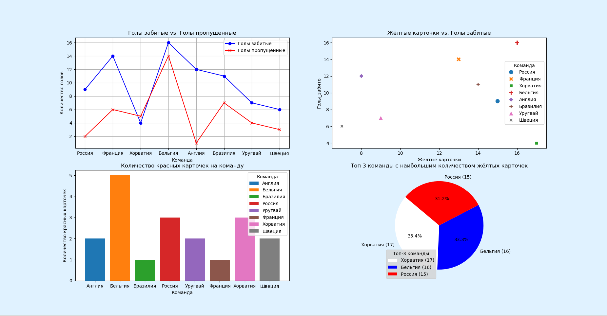
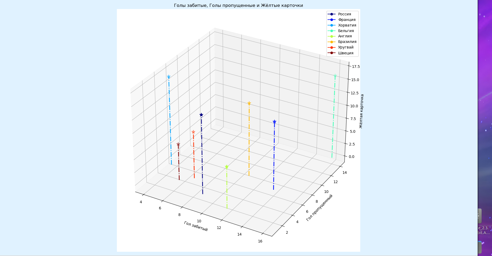

---
## Front matter
title: "Отчёт по лабораторной работе №2"
subtitle: "Постройть осмысленные графики на основе выбранных данных"
author: 
	- Ван Сихэм Франклин (Миша) 1032189251
	- Базлов Владимир Андреевич 1132239401
	- Чилеше Лупупа 1032225194

## Generic otions
lang: ru-RU
toc-title: "Содержание"

## Bibliography
bibliography: bib/cite.bib
csl: pandoc/csl/gost-r-7-0-5-2008-numeric.csl

## Pdf output format
toc: true # Table of contents
toc-depth: 2
lof: true # List of figures
lot: true # List of tables
fontsize: 12pt
linestretch: 1.5
papersize: a4
documentclass: scrreprt

## I18n polyglossia
polyglossia-lang:
  name: russian
  options:
	- spelling=modern
	- babelshorthands=true
polyglossia-otherlangs:
  name: english

## I18n babel
babel-lang: russian
babel-otherlangs: english

## Fonts
mainfont: IBM Plex Serif
romanfont: IBM Plex Serif
sansfont: IBM Plex Sans
monofont: IBM Plex Mono
mathfont: STIX Two Math
mainfontoptions: Ligatures=Common,Ligatures=TeX,Scale=0.94
romanfontoptions: Ligatures=Common,Ligatures=TeX,Scale=0.94
sansfontoptions: Ligatures=Common,Ligatures=TeX,Scale=MatchLowercase,Scale=0.94
monofontoptions: Scale=MatchLowercase,Scale=0.94,FakeStretch=0.9
mathfontoptions:

## Biblatex
biblatex: true
biblio-style: "gost-numeric"
biblatexoptions:
  - parentracker=true
  - backend=biber
  - hyperref=auto
  - language=auto
  - autolang=other*
  - citestyle=gost-numeric

## Pandoc-crossref LaTeX customization
figureTitle: "Рис."
tableTitle: "Таблица"
listingTitle: "Листинг"
lofTitle: "Список иллюстраций"
lotTitle: "Список таблиц"
lolTitle: "Листинги"

## Misc options
indent: true
header-includes:
  - \usepackage{indentfirst}
  - \usepackage{float} # keep figures where there are in the text
  - \floatplacement{figure}{H} # keep figures where there are in the text
---

# Цель работы

Сделать данные понятными и наглядными с помощью библиотеки графической визуализации.

# Задание

Постройте осмысленные графики на основе выбранных данных.

1. График зависимостей (plot), с отображением статистической информации.
2. График разброса значений (scatter).
3. Гистограммы (hist).
4. Круговые диаграммы (pie).
5. Любой 3-мерный график. (для групп с которыми не успел рассмотреть - документация https://matplotlib.org/stable/gallery/mplot3d/index.html)

ВСЕ ВЫПОЛНЯЮТ 1 и 5. ПУНКТ, И ЕЩЁ МИНИМУМ 1 НА ВЫБОР.

> Продублируйте построение графиков для горизонтального среза ваших данных. Графики должны иметь легенду, подписи осей, название, и читабельный вид. Оценивается в том числе сама визуализация данных (визуальная состовляющая, удобочитаемость, осмысленность отображаемых данных/зависимостей). Выполнять можно в команде по двое. Возможно выполнение в 3, если графиков (разных) будет в два раза больше.

# Теоретическое введение

: Описание некоторых библиотек в коде {#tbl:std-dir}

| Библиотека | Описание |
|---|---|
| `pandas`  | Для работы с данными в формате DataFrame.  |
| `matplotlib.pyplot`  | Для создания различных типов графиков.  |
| `io`  | Для чтения данных из строки в формате CSV.  |
| `seaborn`  | Для создания эстетически привлекательных статистических графиков.  |
| `matplotlib.patches`  | Для создания дополнительных элементов на графиках.  |
| `mpl_toolkits.mplot3d`  | Для создания трехмерных графиков.  |
| `matplotlib.colors`  | Для работы с цветовыми палитрами.  |


: Описание некоторых команд в коде {#tbl:std-dir1}

| Команда | Описание |
|---|---|
| `plt.subplots` | Создаёт основу для графика - холст, на котором будут располагаться элементы. | 
| `set_facecolor` | Устанавливает цвет фона для фигуры. |
| `plot`  | Строит линию на графике |
| `set_title` | Устанавливает заголовок для графика.  |
| `set_xlabel` | Устанавливает подпись для оси X. |
| `set_ylabel` | Устанавливает подпись для оси Y. |
| `set_xticks` | Устанавливает значения и поворот меток на оси X. |
| `.legend` | Отображает легенду для графика, если у линий установлены метки с помощью label. |
| `.grid` | Включает или выключает сетку на графике. |


# Выполнение лабораторной работы
## Код на языке Python (Змейка)

```python
	
import pandas as pd
import matplotlib.pyplot as plt
from io import StringIO  # CSV-данные в строковой переменной
import seaborn as sns
import matplotlib.patches as patches
from mpl_toolkits.mplot3d import Axes3D
import matplotlib.colors as mcolors


#Данные находятся в виде строки)
data = """
Команда,Голы_забито,Голы_пропущено,Жёлтые_карточки,Красные_карточки
Россия,9,2,15,3
Франция,14,6,13,1
Хорватия,4,5,17,3
Бельгия,16,14,16,5
Англия,12,1,8,2
Бразилия,11,7,14,1
Уругвай,7,4,9,2
Швеция,6,3,7,2
"""

df = pd.read_csv(StringIO(data), sep=",")

#Создание фигуры из 2 строк и 2 столбцов
fig, axes = plt.subplots(nrows=2, ncols=2, figsize=(18, 10))

#Настройка цвет фона
fig.set_facecolor('#e0f2ff')

#График 1: Забитые и пропущенные голы (линейный график)
axes[0, 0].plot(df['Команда'], df['Голы_забито'], marker='o', label='Голы забитые', 
	color='blue')
axes[0, 0].plot(df['Команда'], df['Голы_пропущено'], marker='x', 
	label='Голы пропущенные', color='red')
axes[0, 0].set_title('Голы забитые vs. Голы пропущенные')
axes[0, 0].set_xlabel('Команда')
axes[0, 0].set_ylabel('Количество голов')
axes[0, 0].set_xticks(axes[0, 0].get_xticks(), rotation=45)
axes[0, 0].legend()
axes[0, 0].grid(True)

#График 2: Жёлтые карточки и забитые голы (роевой график)
sns.scatterplot(x='Жёлтые_карточки', y='Голы_забито', data=df, hue='Команда', 
    style='Команда', s=100, ax=axes[0, 1])

#Настройка метки и заголовок
axes[0, 1].set_title('Жёлтые карточки vs. Голы забитые')
axes[0, 1].set_xlabel('Жёлтые карточки')
axes[0, 1].set_ylabel('Голы_забито')

#График 3: Количество красных карточек на команду (столбчатая диаграмма)
team_quantity_redcards = df.groupby('Команда')['Красные_карточки'].sum()  
colors = plt.cm.tab10.colors[:len(team_quantity_redcards)]  

#Cоздание столбчатой диаграммы для визуализации (X-ось, Y-ось)
bars = axes[1, 0].bar(team_quantity_redcards.index, team_quantity_redcards.values, 
	color=colors)

#Создание легенда
axes[1, 0].legend(bars, team_quantity_redcards.index, title='Команда')

#Настройка метки и заголовок
axes[1, 0].set_title('Количество красных карточек на команду')
axes[1, 0].set_xlabel('Команда')
axes[1, 0].set_ylabel('Количество красных карточек')
axes[1, 0].set_xticks(axes[1, 0].get_xticks(), rotation=45)


#График 4: Топ-3 команды по жёлтым карточкам (круговая диаграмма)
top_3_teams = df.nlargest(3, 'Жёлтые_карточки')['Команда']
	yellow_cards_top_3 = df.nlargest(3, 'Жёлтые_карточки')['Жёлтые_карточки'].values


#Создание списка меток с указанием количества желтых карточек
labels = [f"{team} ({yellow_cards})" for team, yellow_cards in zip(top_3_teams,
	yellow_cards_top_3)]


#Создание цветов для круговой диаграммы как флага России
colors = ['#FFFFFF', '#0000FF', '#FF0000']

#Создание круговой диаграммы
wedges, texts, autotexts = axes[1, 1].pie(yellow_cards_top_3, labels=labels, 
    autopct='%1.1f%%', startangle=140, colors=colors)

#Отрегулироввать размер текста
for text in texts:
    text.set_fontsize(10)

axes[1, 1].set_title('Топ 3 команды с наибольшим количеством жёлтых карточек')

# Создание легенды
axes[1, 1].legend(labels, title='Топ-3 команды', loc='lower left', 
	facecolor='lightgray')

#Создайте цветовую карту и словарь, чтобы сопоставить команды по цветам
cmap = plt.cm.get_cmap('jet', len(df['Команда'].unique()))
colors = dict(zip(df['Команда'].unique(), cmap(range(len(df['Команда'].unique())))))

#Создание фигуры с размером (18, 10)
fig = plt.figure(figsize=(18, 10)) 
fig.patch.set_facecolor('#e0f2ff')

#Создание 3D-фрагмент для точечной диаграммы
ax3 = plt.axes(projection='3d')
ax3.scatter(df['Голы_забито'], df['Голы_пропущено'], df['Жёлтые_карточки'],
           c=df['Команда'].map(colors), cmap='jet', s=100, marker='*')

#Вертикальные линии к базовой плоскости
for team, goals_scored, goals_conceded, yellow_cards in zip(df['Команда'], 
    df['Голы_забито'], df['Голы_пропущено'], df['Жёлтые_карточки']):
    		ax3.plot([goals_scored, goals_scored], [goals_conceded, 
    		goals_conceded], [0, yellow_cards], color=colors[team], 
    		linestyle='-.', linewidth=2) 

#Настройка метки и заголовок
ax3.set_xlabel('Гол забитый')
ax3.set_ylabel('Гол пропущенный')
ax3.set_zlabel('Жёлтая карточка')
ax3.set_title('Голы забитые, Голы пропущенные и Жёлтые карточки')

#Настройка легенда
handles = [plt.Line2D([], [], marker='o', color=color, label=team) for team, 
	color in colors.items()]
ax3.legend(handles=handles)


#настройка макета
plt.tight_layout()

#Показ диаграммы
plt.show()
```

## Вывод кода

{#fig:001 width=70%}

{#fig:002 width=70%}

# Краткое описание кода

Дана таблица с результатами футбольных матчей разных команд. Этот код создает несколько графиков на данных о футбольных матчах. Он использует библиотеку `Pandas` для обработки данных, а `Matplotlib` и `Seaborn` для визуализации. Графики показывают различные аспекты данных, такие как количество забитых и пропущенных голов, количество желтых и красных карточек, а также взаимосвязи между этими показателями. Код также включает настройку внешнего вида графиков, добавление легенд, подписей осей и заголовков.

В целом, этот код демонстрирует мощь библиотек `Python` для визуализации данных и анализа спортивных результатов.


# Выводы

В ходе выполнения данной работы были освоены следующие навыки:

* Работа с библиотеками Python для визуализации данных
* Визуальное представление данных
* Настройка графиков
* Анализ данных
* Создание 3D-графиков

Данная лабораторная работа позволила развить навыки работы с данными и визуализации, которые могут быть полезны в различных сферах деятельности, требующих анализа и представления информации в понятной форме.

# Список литературы{.unnumbered}

1. https://www.mathworks.com/help/matlab/ref/colormap.html
2. http://www.sthda.com/english/wiki/scatterplot3d-3d-graphics-r-software-and-data-visualization
3. https://matplotlib.org/stable/users/explain/axes/tight_layout_guide.html
4. https://matplotlib.org/stable/gallery/mplot3d/index.html)

::: {#refs}
:::
